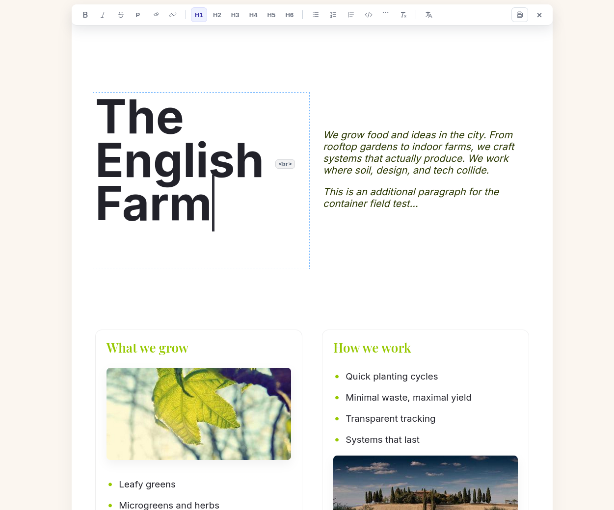
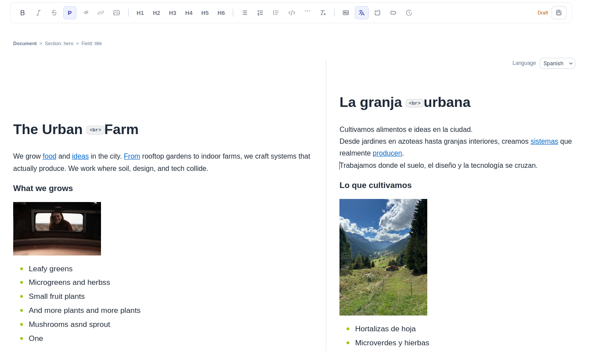

# MarkdownToFieldsFrontEditor

This is the **front‑end editor** for [MarkdownToFields](https://github.com/lemachinarbo/MarkdownToFields).
The name is horrible, but it lets you double‑click tagged content and edit it right on the page (yes I know ProcessWire does that, but this is different and this is mine).

It is NOT a standalone module. It only works **together** with MarkdownToFields.

## What it does

- Double‑click any tag field `<!-- field -->` or container field `<!-- container... -->` to edit it.
- Save the change back to the markdown file.
- Supports multiple languages (uses ProcessWire languages).
- It supports two different views: 

### Inline 

The best for quick edits.

### Fullscreen 
Amazing for comparing content in different languages

## Install

**MarkdownToFields** must be installed and your content ready and tagged. The module auto‑detects `tag fields` and `container fields` once it’s installed. And you can edit them by double‑clicking.

1. Install the module using your preferred [method](https://modules.processwire.com/install-uninstall/).
2. Give your editors the `page-edit-front` permission.

## Configuration

In module settings:

- **Editor View**: `fullscreen` or `inline`.
- **Toolbar Buttons**: comma list like:
  `bold,italic,strike,paragraph,|,h1,h2,h3,|,ul,ol,blockquote,|,link,unlink,|,code,codeblock,clear,|,split`

Notes:
- `|` adds a separator.
- `save` is always shown at the end.

## Requirements

- ProcessWire + MarkdownToFields
- Tagged markdown (content tags)
- `page-edit-front` permission

## Support

This module is small and opinionated. If something breaks, start by (shaking) checking:

- the markdown file
- the tags (`<!-- name -->`, `<!-- name... -->`)
- the permission (`page-edit-front`)
- the AI

## License

UBC+P.

Use it.
Break it.
Change it.
And if you make money, buy us some pizza.