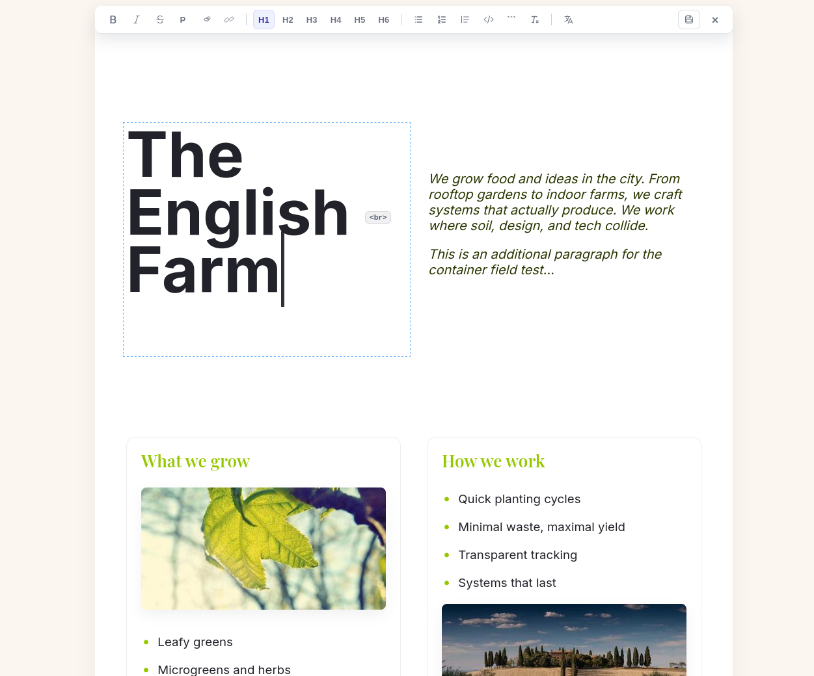
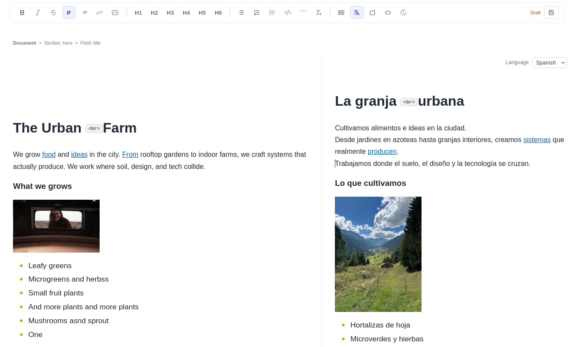

# MarkdownToFieldsFrontEditor

This is the **front‑end editor** for [MarkdownToFields](https://github.com/lemachinarbo/MarkdownToFields).
The name is horrible, but it lets you double‑click tagged content and edit it right on the page (yes I know ProcessWire does that, but this is different and this is mine).

It is NOT a standalone module. It only works **together** with MarkdownToFields.

## What it does

- Double‑click any tag field `<!-- field -->` container field `<!-- container... -->`, section `<!-- section:name -->` or subsection `<!-- sub:name -->` to edit it.
- Save the change back to the markdown file.
- Supports multiple languages (uses ProcessWire languages).
- It supports two different views: 

### Inline 

`Ctrl + double click` The best for quick edits (Only avaible for `tag fields`).



### Fullscreen 
`double click` Amazing for comparing content in different languages



## What's New

**0.4.3**
- New optional `data-mfe` hosts for precise section/subsection rollovers in complex templates.


**0.4.2**
- Marker labels now render with section/sub/field styles and stay non‑editable.
- Unified markdown → editor rendering for inline/fullscreen (more consistent markers and output).
- Split view translations are more stable across field/section switches.
- Image picker listing hardened for missing/permissioned folders.
- Inline HTML is preserved on save: `strong`, `em`, `del`, `u`, `sup`, `sub`, `br` (no `span`).

**0.4.2.beta.2**
- Image support (images in editor can be updated on double click).

**0.4.1**
- Breadcrumbs in fullscreen allow you to edit ancestors (section > subsection > container > field).
- Section breadcrumb is disabled when the section has no direct content.
  
**0.4**
- Adds sections/subsections support.
- New hybrid system: inline editing + fullscreen editing.

**0.3**
- Official launch of the front-end editor tested in one machine, one installation, one browser.


## Install

**MarkdownToFields** must be installed and your content ready and tagged. The module auto‑detects `tag fields` and `container fields` once it’s installed. And you can edit them by double‑clicking.

1. Install the module using your preferred [method](https://modules.processwire.com/install-uninstall/).
2. Give your editors the `page-edit-front` permission.


## Configuration

In module settings:

- **Toolbar Buttons**: comma list like:
  `bold,italic,strike,paragraph,|,h1,h2,h3,|,ul,ol,blockquote,|,link,unlink,|,code,codeblock,clear,|,split`

Notes:
- `|` adds a separator.
- `save` is always shown at the end.

## Editing Behavior

- **Tag fields**: `Ctrl + double-click` opens **inline** editor.
- **All other targets**: double-click opens **fullscreen** editor.

If a section only contains subsections, it may not have its own content. In that case the section breadcrumb is shown but not clickable.

### Template Output Notes

- Rendering `->html` preserves the original MarkdownToFields HTML, so the editor can auto‑wrap fields and show **rollover** zones.
- Rendering `->text` (or otherwise transforming the HTML) breaks that exact match, so **field rollovers won’t appear**.
  - In this case, you can still define explicit section/subsection hosts in your template (see below).

### Custom editable zones

If your templates render fields individually (instead of raw section HTML), add a **lightweight host** to define a editable zone (aka the zone that appears when you rollover):

**Section**
```html
<section data-mfe="hero">
  ...
</section>
```

**Subsection**
```html
<div data-mfe="hero:left">
  ...
</div>
```

**Field (top-level or sectioned)**
```html
<div data-mfe="title">...</div>
<div data-mfe="hero/title">...</div>
```

Rules:
- `data-mfe="hero"` → section host
- `data-mfe="hero:left"` → subsection host (section `hero`, subsection `left`)
- `data-mfe="title"` → field host (auto-resolves field first, then section fallback)
- `data-mfe="hero/title"` → field host inside section `hero`
- Explicit forms are also supported: `field:title`, `field:hero/title`, `section:hero`, `sub:hero/left`
- The closest `data-mfe` host controls the rollover bounds for that area.


#### Clicking the zones

Depending on your layout, when double clicking a clickable zone you can click a real link therefore you will be redirected to anopther page. In those cases use ctrl + click.

## Requirements

- ProcessWire + MarkdownToFields
- Tagged markdown (content tags)
- `page-edit-front` permission

## Support

This module is small and opinionated. If something breaks, start by (shaking) checking:

- the markdown file
- the tags (`<!-- name -->`, `<!-- name... -->`, `<!-- section:name -->`, `<!-- sub:name -->`)
- the permission (`page-edit-front`)
- the AI

## License

UBC+P.

Use it.
Break it.
Change it.
And if you make money, buy us some pizza.

Deployed by [mutants.txt](mutants.txt)