# Editor dependency graph (Scope / View / Host)

This graph reflects the implemented layering after host/shell decoupling.

```mermaid
graph TD
  subgraph Core["Scope Core (pure logic)"]
    SR[session-resolver.js]
    SK[sync-by-key.js]
    DU[draft-utils.js]
    EC[editor-core.js]
  end

  subgraph View["View Layer (representation only)"]
    EX[editor-tiptap-extensions.js]
    DB[document-boundary-extension.js]
    TB[editor-toolbar.js]
    TR[editor-toolbar-renderer.js]
    FC[field-constraints-extension.js]
    FH[field-constraints-toolbar.js]
  end

  subgraph Host["Host Layer (UI shell)"]
    IN[editor-inline.js]
    FS[editor-fullscreen.js]
    HR[host-router.js]
    IS[inline-shell.js]
    FSS[fullscreen-shell.js]
    WM[window-manager.js]
    OE[overlay-engine.js]
    IM[image-picker.js]
  end

  subgraph Infra["Read model + metadata"]
    CI[content-index.js]
    SH[editor-shared-helpers.js]
    ST[editor-status.js]
  end

  IN --> SR
  FS --> SR
  IN --> HR
  FS --> HR
  IN --> IS
  FS --> IS
  FS --> FSS
  IN --> EC
  FS --> EC
  IN --> SK
  FS --> SK
  IN --> SH
  FS --> SH
  IN --> CI
  FS --> CI
  IN --> OE
  FS --> WM
  IN --> IM
  FS --> IM
  IN --> ST
  FS --> ST

  TB --> FH
  IN --> TB
  FS --> TB
  IN --> TR
  FS --> TR

  FS --> DB
  IN --> EX
  FS --> EX
  IN --> FC
  FS --> FC

  SK --> CI
  SH --> EC
  DU --> SK
```

## Current contract status

- ✅ No direct `editor-inline.js` → `editor-fullscreen.js` import.
- ✅ Host switching is routed through `host-router.js`.
- ✅ Fullscreen/inline/document shell body classes are handled by shell adapters.
- ✅ Behavior and shell contracts are locked by dedicated tests.

## Guardrails

- Keep scope modules pure (no DOM reads/writes).
- Keep view modules representational (no save/scope routing).
- Keep host modules orchestration-only; shell adapters own body class/attribute mutation.
- Keep identity deterministic (`scope.key` and scoped key routing, no fuzzy matching).

## Enforced order

1. Scope core extraction and purity (`session-resolver.js` + key identity only).
2. Deterministic target addressing only (no fuzzy htmlMap matching).
3. Host adapter split (`inline` and `fullscreen` call shared scope session APIs).
4. Host-to-host dependency removal (`inline` ↔ `fullscreen` decoupling via router).
5. Shell ownership centralization (`inline-shell` / `fullscreen-shell`).
6. Optional view additions (`outline`, `tree`, `raw`) using the same scope session.
